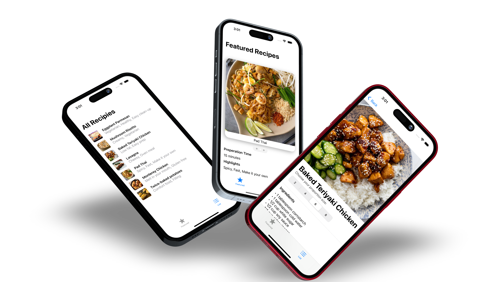

# Simple recipe app from Tutorial. 

## Description
This is a simple app made from following a tutorial. The tutorial is part of a IOS foundations course. This app uses a MVVM strucutre and introduces different 
IOS concepts. Apart from this app, several smaller app were made to grasp different concepts such as geometryReader, json parsing, tabview, pickers etc. 

## I learened:
* MVVM structure
* Json structure and parsing
* Data flow with enviromental objects
* Navigation view and links
* Variable two way binding.
* Multiple views
* Lazy rendering
* Picker component
